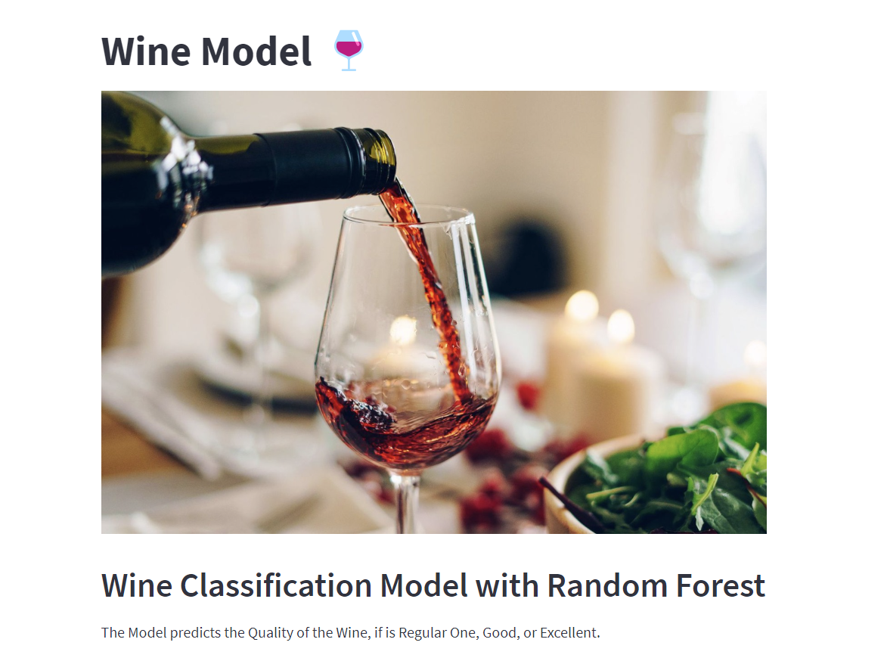

# Wine Model


## Multi-Classification Wine Model

The Model predicts if a Wine is Regular, Good or Excellent by their levels of alcohol, pH, sulphates, citrics, etc.

The differents Machine Learning Algorithms that was used for the Wine Dataset were:
- `Keras Nearest Neighboor`
- `Naive Bayes`
- `SVC`
- `Random Forest`
- `Stochastic Gradient Descent`

The Random Forest Model has the best result, with a 70% Accuracy of the three differentes Wine Classes.

## Check-it out
Test the Model by yourself running the `main.py` file, built with `Streamlit`.



## Run
```sh
streamlit run main.py
```


